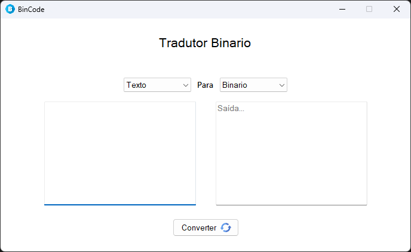

# **BinCode  - Conversor Binario**  
Um software para converter texto para binario e para traduzir codigos binarioss!  


<table>
  <tr>
    <td align="left">
        <br>
    </td>
  </tr>
</table>

## **📋 Pré-requisitos**  
Antes de começar, verifique se você possui o seguinte:  
- Sistema operacional Windows de 64 bits

## **⚙️ Execução**  
- Você poderá acessar o sistema software baixando o arquivo BinCode.exe no diretorio:

```bash
    /exe/BinCode.exe
```
## **🛠️ Tecnologias e Ferramentas Utilizadas**  
Este projeto foi desenvolvido utilizando as seguintes tecnologias e ferramentas:  


## **📌 Versão**  
Consulte as [tags neste repositório](https://github.com/devsamuelsouza/bin-code/tags) para visualizar as versões do projeto. 

## **✒️ Autor**  
Desenvolvido por **Samuel Souza** 🌹  
- [GitHub](https://github.com/devsamuelsouza)  
- [LinkedIn](https://www.linkedin.com/in/devsamuel/)  

---